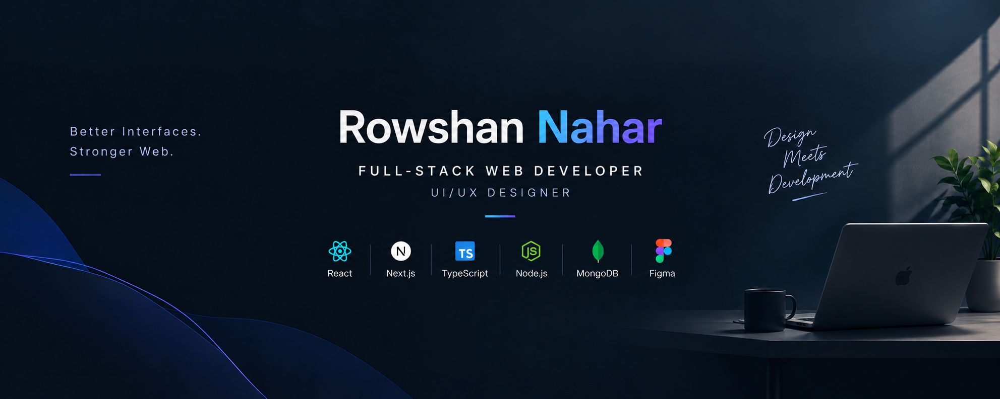

 

# Rowshan Nahar

### Full-Stack Web Developer · UI/UX Designer · AI-Focused Engineer

  
  
  

---

## 👋 About

I build interfaces that feel right and systems that hold up: clean component architecture, responsive and accessible UI, and full-stack applications built end to end. My design experience shapes how I approach engineering. I think about the user first, then the code.

I am a Computer Science & Engineering graduate with a background in UI/UX design, focused on building modern web experiences and exploring the intersection of web engineering, product design, and AI.

Alongside web development, I am exploring **machine learning, deep learning, and computer vision**, and I'm focused on bringing AI into real products, from LLM-powered features to intelligent user experiences.

---

## 📍 Current Status

| | |
| :-- | :-- |
| 🎯 **Target** | Junior / Associate Full-Stack, Frontend, or AI-Integration Engineer |
| 🌍 **Open to** | Remote · Relocation · On-site, national and international |
| 📚 **Learning** | Full-stack architecture, TypeScript depth, system design, data structures & algorithms |
| 🔨 **Building** | Deployed full-stack projects with authentication, databases, and AI features |
| 🎨 **Strength** | Design-to-code: Figma → production-ready React/Next.js |

---

## 🛠️ Tech Stack

**Core**

**Backend & Data (actively expanding)**

**AI / ML**

**Languages & Foundations**

**Design & Tooling**

---

## 🧭 What I Bring

| 🌐 Engineering | 🎨 Product & Design | 🤖 AI & Intelligent Systems |
| :-- | :-- | :-- |
| Component-driven frontend architecture | Figma, prototyping, design systems | Machine learning & deep learning fundamentals |
| REST APIs, auth, and databases | Responsive, accessible interfaces | Computer vision |
| Git workflows and deployment | Design-to-code handoff | LLM API integration in web apps |

---

## 🤝 Let's Connect

I'm open to **junior and associate developer roles, internships, and freelance projects**, and always happy to talk design, web, and AI.

 

**Better Interfaces. Stronger Web.**

